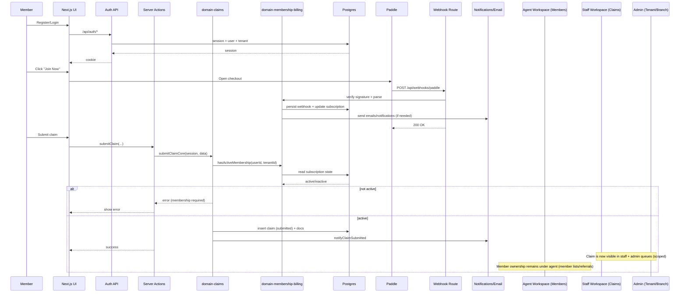
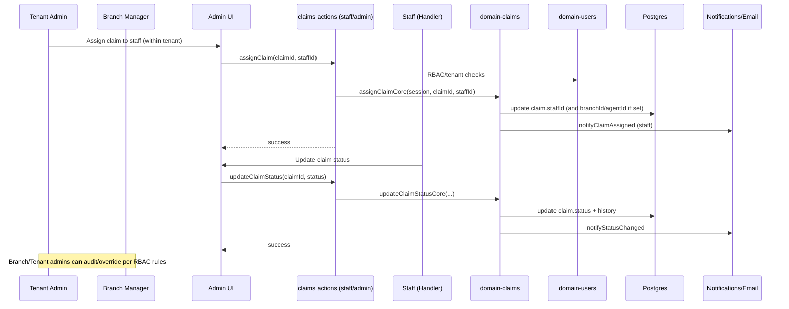

# Interdomestik — App Flowchart (Illustration)

This document contains Mermaid diagrams you can render directly in VS Code (Markdown Preview) to create an illustration of the system.

---

## 1) Org Hierarchy + System Flowchart (Main Illustration)

```mermaid
flowchart TB
  %% Actors / Roles
  SuperAdmin([Super Admin\n(Global)])
  TenantAdmin([Tenant Admin\n(MK, XK, …)])
  BranchManager([Branch Manager\n(Branch)])
  Agent([Agent\n(Branch)\n(owns members)])
  Staff([Staff\n(Branch)\n(handles claims)])
  Member([Member\n(assigned to Agent)])

  %% Web UI
  %% Org model (conceptual)
  subgraph ORG[Organization Model]
    Tenant[(Tenant: MK / XK / …)]
    Branch[(Branch: Town)]
  end

  %% Web UI
  subgraph WEB_UI[apps/web — UI (Next.js)]
    MemberUI[Member Portal UI\n(/member/*)]
    AgentUI[Agent Workspace UI\n(/agent/*)]
    StaffUI[Staff Workspace UI\n(/staff/*)]
    AdminUI[Admin UI\n(/admin/*)]
    SuperAdminUI[Super Admin UI\n(/admin/* with global scope)]
  end

  %% Web App Backend Surface
  subgraph WEB_BACKEND[apps/web — Backend Surface]
    AuthAPI[Auth Route\n/api/auth/*]
    ClaimsActions[Claims Server Actions\nsrc/actions/claims.core.ts]
    StaffClaimsActions[Staff Claims Server Actions\nsrc/actions/staff-claims.core.ts]
    PaddleWebhook[Webhook Route\nPOST /api/webhooks/paddle]
  end

  %% Domain packages
  subgraph DOMAINS[packages/* — Domain Business Logic]
    DomainClaims[domain-claims\ncreate/submit/status/assign]
    DomainUsers[domain-users\nRBAC + agent assignment\nensure tenant]
    DomainBilling[domain-membership-billing\nsubscription + Paddle + webhooks]
    DomainComms[domain-communications\nemail + notifications]
    SharedAuth[shared-auth\nsession + tenant helpers]
  end

  %% Data + external providers
  subgraph DATA[packages/database]
    Drizzle[Drizzle ORM Schema]
    Postgres[(Postgres)]
  end

  Paddle((Paddle))
  Email((Email/Notifications))

  %% === Org hierarchy ===
  SuperAdmin --> SuperAdminUI
  TenantAdmin --> AdminUI
  BranchManager --> AdminUI
  Agent --> AgentUI
  Staff --> StaffUI
  Member --> MemberUI

  SuperAdmin --> Tenant
  TenantAdmin --> Tenant
  Tenant --> Branch
  BranchManager --> Branch
  Branch --> Agent
  Branch --> Staff
  Agent --> Member

  %% === Auth / tenant-scoped data ===
  MemberUI --> AuthAPI
  AgentUI --> AuthAPI
  StaffUI --> AuthAPI
  AdminUI --> AuthAPI
  SuperAdminUI --> AuthAPI

  AuthAPI --> SharedAuth
  SharedAuth --> Drizzle
  Drizzle --> Postgres

  %% === Claims (member) ===
  MemberUI --> ClaimsActions
  ClaimsActions --> SharedAuth
  ClaimsActions --> DomainClaims
  DomainClaims --> DomainBilling
  DomainClaims --> Drizzle
  DomainBilling --> Drizzle
  Drizzle --> Postgres
  DomainClaims --> DomainComms
  DomainComms --> Email

  %% === Membership billing/webhooks ===
  MemberUI --> Paddle
  Paddle --> PaddleWebhook
  PaddleWebhook --> DomainBilling
  DomainBilling --> Drizzle
  DomainBilling --> DomainComms

  %% === Staff/Admin claim operations ===
  StaffUI --> StaffClaimsActions
  AdminUI --> StaffClaimsActions
  SuperAdminUI --> StaffClaimsActions

  StaffClaimsActions --> SharedAuth
  StaffClaimsActions --> DomainClaims
  StaffClaimsActions --> DomainUsers

  DomainUsers --> SharedAuth
  DomainUsers --> Drizzle
  DomainClaims --> Drizzle

  DomainClaims --> DomainComms
```

---

## 2) Member → Membership → Claim → Agent/Branch/Tenant Oversight (Sequence)



---

## 3) Agent/Branch/Tenant Admin Claim Assignment + Status Updates (Sequence)



---

## Exporting the Illustration

- VS Code: open this file and use **Markdown Preview**. If you have Mermaid support enabled, diagrams render automatically.
- If you want PNG/SVG export, use `@mermaid-js/mermaid-cli` (mmdc) or an online Mermaid renderer.
