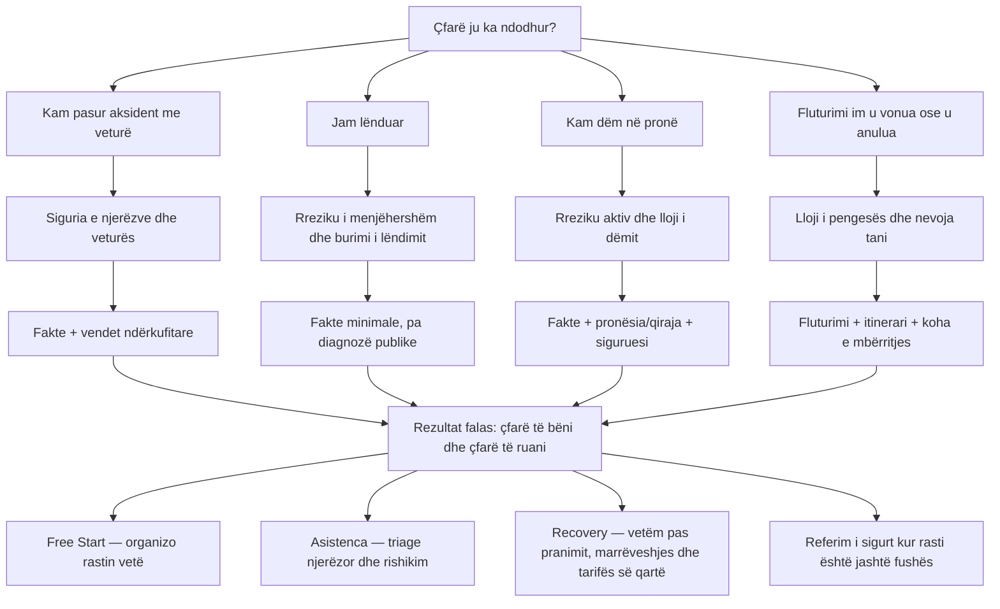

# IDA-DG09 Complete Public Help Now Journey Map — Discussion Draft

> **Discussion material for Arben and Gazmend.** This document does not promote a
> runtime slice. `IDA-UI01c` remains the sole active implementation slice and remains
> limited to the vehicle-accident journey. Injury, property, flight, and channel
> landing-page runtime work require separate design gates and sequential promotion.

## Decision in one sentence

The public hero is one calm help-first sales entrance with four situation doors;
each door first removes immediate uncertainty, then organizes the minimum facts, and
only then offers the right Interdomestik commercial service.

## Portfolio model

## Rregullat që vlejnë për të katër pemët

1. **Lehtësim para formularit.** Pa llogari, pagesë ose ngarkim dokumentesh para
   përgjigjes së parë të dobishme.
2. **Një pyetje kryesore në ekran.** Nuk shfaqet një formular i gjatë dhe nuk
   premtohet numër fiks hapash.
3. **Siguria e ndërpret shitjen.** Rreziku, lëndimi i paqartë, zjarri, vjedhja aktive
   ose nevoja urgjente e udhëtimit japin udhëzim sigurie para çdo CTA-je.
4. **Pyetjet ndjekin vendimin.** Kërkohet vetëm fakti që ndryshon degën tjetër.
5. **Diaspora është kontekst real.** Vendi i incidentit, regjistrimi, siguruesi,
   nisja/destinacioni dhe vendbanimi nuk bashkohen në një fushë `country`.
6. **Rezultati falas është i plotë.** Klienti merr listën e veprimit dhe provave edhe
   nëse nuk blen.
7. **Interdomestik fiton kur fillon puna njerëzore.** Triage, rishikimi i dokumenteve,
   përfaqësimi/recovery dhe ndjekja e rastit janë pikat komerciale; siguria bazë nuk
   mbahet peng pas pagesës.

## Pema 1 — Aksident me veturë

### Stabilizo

- `A është dikush i lënduar?`
  - `Po` → siguri, emergjencë lokale, ndalim i përgatitjes së zakonshme.
  - `Nuk jam i sigurt` → trajtohet si lëndim i mundshëm.
  - `Jo, vetëm dëm material` → kontrollo sigurinë e veturës.
- `A mund të lëvizet vetura pa rrezik?`
  - `Jo / nuk jam i sigurt` → mos e lëviz; ndihmë rrugore/emergjencë.
  - `Po` → vazhdo te konteksti.

### Qartëso

- Ku ndodhi aksidenti?
- Ku është regjistruar vetura?
- Nga cili vend është siguruesi ose vetura tjetër?
- A ka mosmarrëveshje, largim nga vendi, mungesë prove sigurimi, dëm publik ose palë
  tjetër të cenueshme?

### Jep rezultat

- fotografi të skenës, dëmit dhe targave;
- sigurimi/Green Card, data, ora, vendi dhe dëshmitarët;
- referencë policie/EAS vetëm kur zbatohet dhe është dhënë;
- pa konkluzion specifik shtetëror pa paketë rregullash të nënshkruar.

### Konverto

- `Organizo të dhënat e rastit` → Free Start me `vehicle` të konfirmuar;
- `Dua rishikim njerëzor` → Asistenca;
- `Dua që Interdomestik ta ndjekë rikuperimin` → vlerësim, pranim, marrëveshje dhe
  tarifë transparente para punës së stafit.

## Pema 2 — Jam lënduar

### Stabilizo

- `A jeni tani në rrezik ose pa vlerësim të nevojshëm mjekësor?`
  - `Po / nuk jam i sigurt` → shërbimet lokale të emergjencës ose vlerësim profesional.
  - `Jo` → vazhdo pa kërkuar diagnozë, dokument mjekësor ose identitet të personit të
    lënduar në sipërfaqen publike.

### Qartëso burimin, jo diagnozën

- aksident trafiku → bashkohet me pemën e veturës në degën e lëndimit;
- lëndim në punë;
- rrëzim ose incident në hapësirë publike/private;
- trajtim mjekësor që mund të ketë shkuar keq;
- produkt ose pajisje;
- sulm/incident tjetër;
- `nuk jam i sigurt` → orientim njerëzor pa pretendim kualifikimi.

### Jep rezultat

- sigurohuni dhe kërkoni vlerësim profesional kur duhet;
- ruani datën, vendin, raportin e incidentit, fotografitë dhe dëshmitarët;
- ruani faturat dhe ndikimin financiar për një fazë të autorizuar më vonë;
- mos jepni diagnozë, vlerë kompensimi ose premtim se ekziston kërkesë.

### Konverto

- Free Start informativ për organizimin e vijës kohore;
- Asistenca për rishikim njerëzor dhe kufirin e mbulimit;
- recovery ose referim te specialisti vetëm pas kontrollit të juridiksionit,
  përgjegjësisë, afatit dhe marrëveshjes së tarifës.

## Pema 3 — Kam dëm në pronë

### Stabilizo

- `A ka rrezik aktiv tani?`
  - zjarr, ujë aktiv, gaz/rrymë, strukturë e pasigurt, hyrje me forcë në vazhdim →
    shërbime lokale/emergjencë dhe mos u fut në hapësirë të pasigurt;
  - rreziku është ndalur → vazhdo.

### Qartëso

- lloji: ujë, zjarr/tym, stuhi, vjedhje/vandalizëm, dëmtim nga fqinji/qiramarrësi,
  përgjegjësi e pronarit/objektit, tjetër;
- roli: pronar, qiramarrës, biznes, përfaqësues i autorizuar;
- vendi i pronës;
- a ka sigurues, pronar/menaxher, kontraktor ose palë tjetër;
- a është banesa e pabanueshme ose ka nevojë për masë urgjente kufizuese.

### Jep rezultat

- dokumentoni para pastrimit kur është e sigurt;
- ndaloni përkeqësimin pa asgjësuar prova;
- ruani policën/qiranë, njoftimet, fotografitë, listën e sendeve dhe preventivat;
- mos premtoni mbulim ose pagesë pa policën dhe faktet.

### Konverto

- Free Start për inventarin dhe kronologjinë;
- Asistenca për rishikim dokumentesh dhe njoftimin e parë;
- recovery vetëm kur ka palë përgjegjëse, rrugë monetare dhe marrëveshje të pranuar.

## Pema 4 — Fluturimi u vonua ose u anulua

> Hero mban shenjën `Së shpejti` derisa kjo pemë, burimi i të dhënave dhe modeli
> komercial të kenë gate të veçantë.

### Stabilizo nevojën e tanishme

- vonesë;
- anulim;
- mohim hipjeje/overbooking;
- lidhje e humbur;
- bagazh i vonuar/humbur/dëmtuar;
- `jam ende në aeroport` → së pari kujdesi, rerouting dhe dokumentimi i ofruar nga
  transportuesi, jo premtimi i kompensimit.

### Qartëso

- data dhe numri i fluturimit;
- aeroporti i nisjes dhe destinacionit final;
- sa vonë mbërriti pasagjeri në destinacionin final;
- njoftimi i linjës ajrore dhe arsyeja, ose `nuk e di`;
- rezervim i vetëm apo bileta të ndara;
- dokumentet: konfirmimi, boarding pass, njoftimet dhe faturat e arsyeshme.

### Jep rezultat

- ndihma dhe kompensimi trajtohen si dy pyetje të ndryshme;
- rezultati është `mund të vlejë kontrolli`, jo `ju takon kompensimi`, derisa rregulli,
  fluturimi dhe përjashtimet të verifikohen;
- shfaqen afati, dokumentet dhe hapi i radhës sipas juridiksionit të pranuar.

### Konverto

- kontroll falas i përshtatshmërisë;
- recovery me success fee të publikuar qartë;
- membership vetëm nëse ofron vlerë të vërtetë paraprake për udhëtarët, jo si pengesë
  artificiale për një kërkesë ekzistuese.

## Ku fillon fitimi i Interdomestik

| Moment                | Klienti merr                 | Interdomestik fiton                                                    |
| --------------------- | ---------------------------- | ---------------------------------------------------------------------- |
| Siguria dhe orientimi | lehtësim i menjëhershëm      | besim dhe lead i kualifikuar, pa pagesë                                |
| Free Start            | paketë e organizuar vetë     | marrëdhënie dhe intent i qartë, pa punë njerëzore                      |
| Asistenca             | triage dhe rishikim njerëzor | anëtarësim vjetor                                                      |
| Recovery i pranuar    | ndjekje aktive e kërkesës    | success fee/minimum fee sipas marrëveshjes                             |
| Jashtë fushës         | referim i ndershëm           | partner/referral vetëm kur është ligjërisht dhe komercialisht i lejuar |

Kjo është arsyeja pse ndihma falas nuk është humbje: ajo largon klientët e gabuar,
organizon faktet para stafit dhe e vendos ofertën me pagesë pikërisht kur klienti
kërkon kohë, ekspertizë ose përfaqësim njerëzor.

## Kanalet e shitjes përdorin të njëjtën pemë

Brokeri, stacioni teknik, agjenti dhe partneri B2B nuk marrin katër produkte të tjera.
Ata marrin landing page me besim, ofertë dhe kod burimi të përshtatur, pastaj hyjnë në
të njëjtën pemë sipas situatës. Burimi i kanalit nuk duhet të ndryshojë rregullat e
sigurisë, kualifikimit ose tarifës.

## Çfarë tregojnë krahasimet komerciale

- ADAC vendos sigurinë, ndihmën e parë dhe provat para riparimit ose kërkesës;
- Irwin Mitchell fillon me dëgjimin, përgjegjësinë, faktet dhe provat, pastaj kalon
  te puna e specialistit;
- Lemonade e bën hyrjen e dëmit shumë të shkurtër dhe e udhëzon përdoruesin sipas
  llojit të dëmit;
- AirHelp fillon me kontrollin e fluturimit dhe e lidh pagesën me recovery, me tarifat
  të publikuara.

Interdomestik duhet të marrë qartësinë dhe shpejtësinë e këtyre modeleve, por jo
pretendimet e tyre të juridiksionit, automatizimit ose disponueshmërisë që nuk janë
provuar për MK/KS/AL/Ballkan/EU.

## Pyetjet për vendimin me Gazmendin

1. A është rendi i implementimit `veturë → lëndim → pronë → fluturim`?
2. Cilat lloje lëndimi i trajton Interdomestik vetë dhe cilat i referon?
3. Cilat masa urgjente të pronës mbeten vetëm orientim dhe ku fillon partneri?
4. A do të jetë fluturimi success-fee, partner referral, apo modul i vetë Interdomestik?
5. Cili benefit i anëtarësimit është real pas incidentit dhe cili është prevention për
   të ardhmen?
6. Cilat kanale B2B/B2B2C marrin landing page të parë pas pemëve publike?

## Rekomandimi i ekzekutimit

1. Mbyll `IDA-UI01c` për aksidentin me veturë dhe provoje në browser/mobile.
2. Mirato këtë hartë si portfolio, jo si një mega-slice.
3. Promovo një gate të veçantë për pemën e lëndimit.
4. Pastaj pronën.
5. Fluturimin vetëm pas autoritetit të rregullave, burimit të të dhënave dhe modelit të
   tarifës.
6. Në fund, ndërto landing pages e kanaleve mbi të njëjtat pemë.

## Burime të krahasimit

- [ADAC — çfarë të bëhet pas aksidentit](https://www.adac.de/rund-ums-fahrzeug/unfall-schaden-panne/unfall/was-tun-nach-unfall/)
- [Irwin Mitchell — procesi i kërkesës për lëndim](https://www.irwinmitchell.com/personal-injury-claims/guides/claims-process)
- [Lemonade — mënyra e paraqitjes së dëmit](https://www.lemonade.com/claims)
- [AirHelp — mënyra dhe tarifat e recovery](https://www.airhelp.co.uk/our-fees/)
