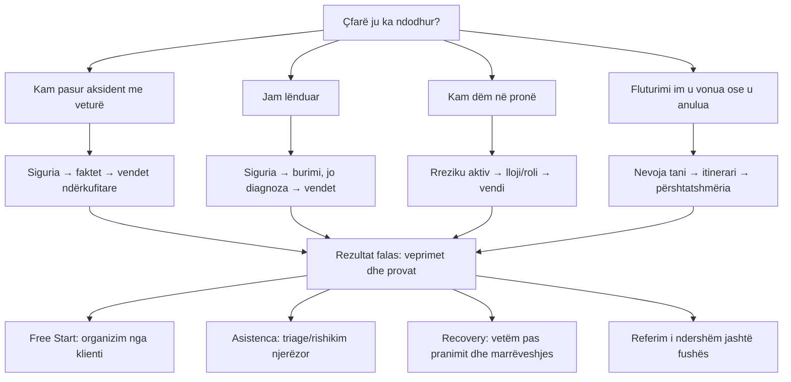

# IDA-DG09 Complete Public Help Now Journey Map

> **Portfolio authority, not a mega-slice.** `IDA-UI01c` is completed through PR
> `#1347`. This gate fixes the shared public Help Now model and the sequential order
> `vehicle → injury → property → flight`. It authorizes no runtime by itself. Every
> remaining branch needs its own narrow gate and exactly one active slice.

## Decision

The public hero is one calm, help-first sales entrance with four personal situation
doors. Each branch first removes immediate uncertainty, then asks only facts that
change the next safe step, gives a useful free result, and only afterwards presents
the appropriate Interdomestik commercial path.

## Kontrata e përbashkët e katër degëve

1. Pa llogari, pagesë, identitet ose dokument para përgjigjes së parë të dobishme.
2. Një pyetje kryesore për ekran; pa formular të gjatë ose premtim hapash fiks.
3. Rreziku ose urgjenca e ndal shitjen dhe jep udhëzim sigurie para CTA-së.
4. Kërkohet vetëm fakti që ndryshon degën; përgjigjet e orientimit janë të përkohshme.
5. Diaspora trajtohet me role të dallueshme vendi, jo me një fushë të paqartë country.
6. Rezultati falas përmban veprimet dhe provat edhe kur klienti nuk blen.
7. Interdomestik monetizon punën njerëzore, rishikimin, anëtarësimin ose recovery-n e
   pranuar; orientimi bazë i sigurisë nuk mbahet pas pagesës.
8. Nuk jepet diagnozë, faj, vlerë kompensimi, mbulim, afat ose këshillë shtetërore pa
   autoritet të nënshkruar për atë rregull.
9. Referral/success fee shfaqet vetëm kur modeli dhe ligjshmëria janë aprovuar veçmas.

## 1. Aksident me veturë — i përfunduar

`IDA-UI01c` dorëzon: lëndim `po / vetëm dëm material / nuk jam i sigurt`, siguri të
veturës, udhëzim universal të provave, vende të ndara të incidentit/veturës/siguruesit,
sinjal diaspora dhe handoff vetëm për veturën. Gjendja është route-local dhe pa egress.

## 2. Lëndim — dega e radhës

### Siguria

Pyetja nuk kërkon vlerësim mjekësor: `A jeni tani në rrezik, keni nevojë për ndihmë
urgjente, ose nuk jeni të sigurt?` `Po` dhe `Nuk jam i sigurt` japin rezultat statik
fail-closed: shërbimet lokale të emergjencës; `112` vetëm me cilësimin se vlen në BE;
asnjë CTA shitjeje në atë rezultat.

### Burimi, jo diagnoza

- aksident trafiku;
- lëndim në punë;
- rrëzim/incident në hapësirë publike ose private;
- produkt ose pajisje;
- problem i dyshuar gjatë trajtimit, me kufi të qartë specialist/referral;
- sulm ose rrezik tjetër, me kufi sigurie/referral;
- nuk jam i sigurt, me orientim statik dhe pa premtim kualifikimi.

Trafiku qëndron në pemën e lëndimit; nuk ridrejtohet në degën emergency të veturës
dhe nuk bart state në të. Mund të ofrohet veçmas hyrja në pemën e veturës nëse ka
edhe dëm automjeti.

### Diaspora dhe rezultati

Pas një burimi jo-urgent kërkohen vetëm vendi i incidentit dhe vendbanimi i zakonshëm,
si zgjedhje të përkohshme dhe të dallueshme. Rezultati jep një listë universale:
siguri/vlerësim profesional kur duhet, datë/vend/raport incidenti, fotografi të sigurta,
dëshmitarë, fatura dhe ndikim financiar. Nuk kërkohet pjesë trupi, diagnozë, trajtim,
identitet ose dokument mjekësor.

### Konvertimi

Vetëm pas rezultatit jo-urgent shfaqet një veprim i ri, i qartë, që nis intake-in
ekzistues Free Start me kategorinë `injury`. Asnjë përgjigje e triage nuk bartet; UI
duhet të tregojë se tani fillon një intake ku klienti zgjedh çfarë dërgon. Asistenca
dhe anëtarësimi janë sekondare. Trajtimi i dyshuar dhe sulmi nuk marrin premtim normal
recovery; japin specialist/referral boundary.

## 3. Dëm në pronë — i aprovuar si drejtim, jo runtime

- Rrezik aktiv: zjarr, ujë/gaz/rrymë, strukturë e pasigurt ose hyrje aktive → siguri.
- Lloji: ujë, zjarr/tym, stuhi, vjedhje/vandalizëm, fqinj/qiramarrës, objekt/pronar,
  produkt/pajisje ose tjetër.
- Roli: pronar, qiramarrës, biznes ose përfaqësues i autorizuar.
- Konteksti: vendi i pronës, siguruesi/menaxheri/pala tjetër dhe banueshmëria.
- Rezultati: dokumentim para pastrimit kur është e sigurt, kufizim dëmi pa shkatërruar
  prova, policë/qira/njoftime/fotografi/inventar/preventiva, pa premtim mbulimi.
- Komercial: Free Start për inventar/kronologji; punë njerëzore vetëm pas opt-in.

## 4. Fluturim — i aprovuar si drejtim, `Së shpejti`

- Lloji: vonesë, anulim, denied boarding, lidhje e humbur ose bagazh.
- `Jam ende në aeroport` → kujdes/rerouting/dokumentim para kompensimit.
- Fakte: numër/datën, nisje/destinacion final, mbërritje reale, arsyen e linjës,
  rezervim i vetëm/bileta të ndara, konfirmim/boarding pass/njoftime/fatura.
- Rezultati dallon të drejtën për kujdes nga kompensimi dhe thotë `mund të vlejë
kontrolli`, jo `ju takon`, derisa rregulli dhe përjashtimet të verifikohen.
- Modeli success-fee/referral dhe burimi i të dhënave kërkojnë gate të veçantë.

## Modeli komercial dhe kanalet

| Moment             | Vlera për klientin       | Vlera për Interdomestik           |
| ------------------ | ------------------------ | --------------------------------- |
| Siguri/orientim    | lehtësim i menjëhershëm  | besim dhe lead i kualifikuar      |
| Free Start         | organizim vetjak         | intent i qartë pa punë njerëzore  |
| Asistenca          | triage/rishikim njerëzor | anëtarësim ose shërbim i aprovuar |
| Recovery i pranuar | ndjekje aktive           | tarifë e qartë sipas marrëveshjes |
| Jashtë fushës      | referim i ndershëm       | vetëm model partner të aprovuar   |

Brokerët, stacionet teknike, agjentët dhe partnerët B2B/B2B2C përdorin landing page
të përshtatur, por hyjnë në të njëjtat pemë. Burimi i kanalit nuk ndryshon sigurinë,
kualifikimin ose tarifën. Landing pages e kanaleve nuk janë pjesë e këtyre slice-ve.

## Krahasimi i operatorëve dhe kufiri i përdorimit

- ADAC përdor hyrje personale `Was ist Ihnen passiert?`, vendos sigurinë/provat para
  kërkesës dhe ndan vendet ndërkufitare; kjo mbështet router-in, jo ligjin tonë.
- Udhëzimi zyrtar i BE-së kërkon dokumentim dhe paralajmëron se ligji i vendit të
  incidentit mund të zbatohet; `112` është falas në BE, jo numër universal global.
- Irwin Mitchell dhe Slater & Gordon frymëzojnë rendin dëgjim → fakte → specialist,
  por nuk janë model rregullator për Interdomestik.
- Lemonade frymëzon hyrjen e shkurtër sipas llojit të dëmit; AirHelp ndan kontrollin
  nga recovery dhe e bën tarifën të dukshme. Pretendimet e tyre nuk importohen.

## Review dhe vendimi

AI OS pas closeout-it të `IDA-UI01c` projektoi saktë `activeSlice=none` dhe
`runtime=not_authorized`; Brain retrieval mbeti stale, prandaj autoriteti u rindërtua
nga repo-ja. Sonnet 4.6 dha `ACCEPT WITH CONDITIONS`; Gemini 3.1 Pro Preview dha
`ACCEPT` pa korrigjime. Gate-i i lëndimit zbaton kushtet:
traffic continuity, safety/referral boundaries, state pa egress, dy role diaspora,
CTA pas rezultatit dhe prova mobile/no-JS/localization. Sugjerimi për një pemë të dytë
server-side pa JavaScript nuk pranohet: kontrata ekzistuese e sigurt është fallback-i
i dukshëm i kategorisë Free Start, jo dy implementime të logjikës.

## Sekuenca e detyrueshme

1. `IDA-DG10` → vetëm `IDA-UI01d` lëndimi.
2. Pas merge/closeout/refreskimit AI OS → gate i pronës.
3. Pas merge/closeout/refreskimit AI OS → gate i fluturimit.
4. Pastaj provë e plotë e pemës; kanalet dhe German mbeten kandidatë veçmas.

## Burime

- [ADAC — Hilfe vom ADAC](https://www.adac.de/hilfe-vom-adac/)
- [ADAC — aksident jashtë vendit](https://www.adac.de/rund-ums-fahrzeug/unfall-schaden-panne/unfall/ausland/)
- [ADAC — çfarë të bëhet pas aksidentit](https://www.adac.de/rund-ums-fahrzeug/unfall-schaden-panne/unfall/was-tun-nach-unfall/)
- [BE — 112](https://digital-strategy.ec.europa.eu/en/policies/112)
- [Your Europe — aksident jashtë vendit](https://europa.eu/youreurope/citizens/vehicles/insurance/accident/indexamp_en.htm)
- [Irwin Mitchell — personal injury guides](https://www.irwinmitchell.com/personal-injury-claims/guides)
- [Slater & Gordon — claims process](https://www.slatergordon.co.uk/personal-injury-claim/claims-process/)
- [Lemonade — claims](https://www.lemonade.com/claims)
- [AirHelp — fees](https://www.airhelp.co.uk/our-fees/)
